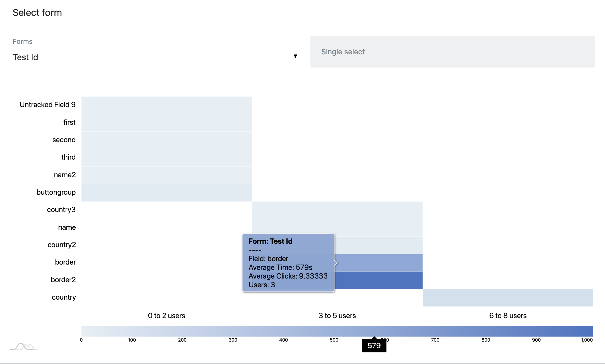
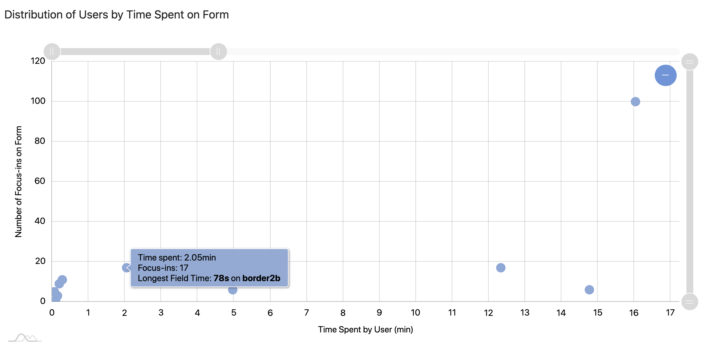

# React Form Analytics

This plugin was built using the amCharts 4 library for Matomo v4.0.0-b2.

## Description 


The React Form Analytics plugin tracks any form that is present in your React App, as well as any user interaction with your forms. 
From there, the plugin will display the average time that users spend on your form, 
as well as the number of users that actually utilizes your form and each field. 
By using this plugin, you will be able to find out the bottlenecks in your form workflows as well as fields that are not being leveraged by users.  

## Installation
To install Matomo, visit the installation guide [here](https://matomo.org/docs/installation/).

### Before using this plugin:  
1) **IMPORTANT:** Activate the CustomDimensions plugin in Matomo (refer to the user guide [here](https://matomo.org/docs/custom-dimensions/))
and set up a custom dimension named `Form` and take note of the **dimension ID**.
2) Add the matomoTracker.js file in the tracker folder into your React app directory.
3) Install the npm package for React Tracking [here](https://www.npmjs.com/package/@datapunt/matomo-tracker-react).  
4) Follow the instructions to wrap your application with `MatomoProvider`.  
5) Instead of adding the tracking code to each of your React components, navigate to your main `App.js` component and add the 
following:  
    ```javascript
    import { useMatomo } from '@datapunt/matomo-tracker-react';
    import * as matomoTracker from "../matomoTracker"; //file path of wherever the matomoTracker.js file was stored
    
    const { trackPageView, trackEvent } = useMatomo();  
    const dimensionID = 1; //or whatever your dimension ID for Form was
    matomoTracker.trackMatomoPages(trackPageView); //optional - used to track pages  
    matomoTracker.handleMatomoForms(trackEvent, dimensionID);
    ```

### Activate plugin
To add to this plugin Matomo, add the entire repository to matomo/plugins folder.  
Activate the plugin from Settings > Plugins or type
`./console plugin:activate ReactFormAnalytics` in the root folder of Matomo.

### Using the plugin

**IMPORTANT:** The plugin assumes that each field and form will have a **unique** name
attribute. Without a name attribute, Matomo will not pick up on the form/field.