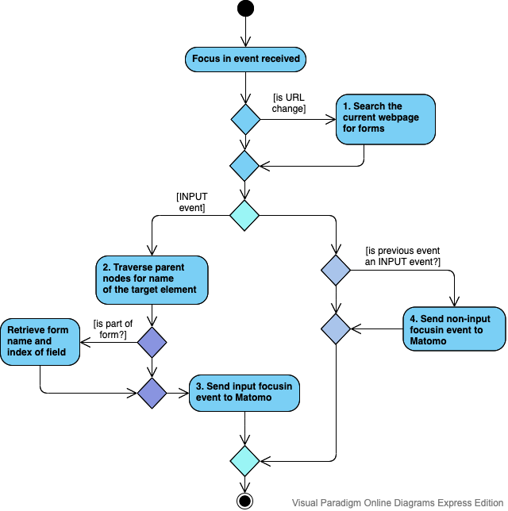
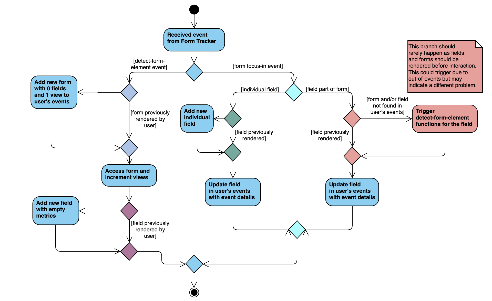
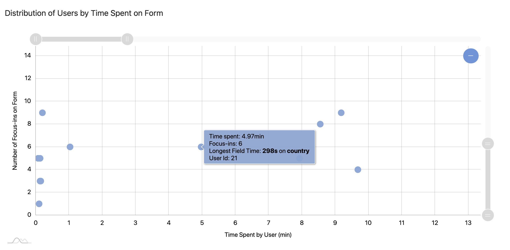

# Developer's Guide

## 1.Installation
To install Matomo, visit the installation guide [here](https://matomo.org/docs/installation/).

### Before using this plugin:  
1) **IMPORTANT:** Activate the CustomDimensions plugin in Matomo (refer to the user guide [here](https://matomo.org/docs/custom-dimensions/))
and set up a custom dimension named `Form` and take note of the **dimension ID**.
2) Add the matomoTracker.js file in the tracker folder into your React app directory.
3) Install the npm package for React Tracking [here](https://www.npmjs.com/package/@datapunt/matomo-tracker-react).  
4) Follow the instructions to wrap your application with `MatomoProvider`.  
5) Instead of adding the tracking code to each of your React components, navigate to your main `App.js` component and add the 
following:  
    ```javascript
    import { useMatomo } from '@datapunt/matomo-tracker-react';
    import * as matomoTracker from "../matomoTracker"; //file path of wherever the matomoTracker.js file was stored
    
    const { trackPageView, trackEvent } = useMatomo();  
    const dimensionID = 1; //or whatever your dimension ID for Form was
    matomoTracker.trackMatomoPages(trackPageView); //optional - used to track pages  
    matomoTracker.handleMatomoForms(trackEvent, dimensionID);
    ```

### Activate plugin
To add to this plugin Matomo, add the entire repository to matomo/plugins folder.  
Activate the plugin from Settings > Plugins or type
`./console plugin:activate matomo-reactformanalytics` in the root folder of Matomo.

### Using the plugin

**IMPORTANT:** The plugin assumes that each field and form will have a **unique** name
attribute. Without a name attribute, Matomo will not pick up on the form/field.
## 2. Design
As Matomo's default tracker does not come with form tracking compatability, there is a need to 
create a tracker to enable form tracking on Matomo. In the plugin, I've made use of Matomo's [event tracking](https://matomo.org/docs/event-tracking/)
function. To make the tracking fuss-free for the user, the Web API's EventListeners were used 
to send events to Matomo automatically by listening to events in the webpage. These events 
are generally split into two different types of events:
1. Rendering form events: The user loads a webpage that contains a form. Events will be sent to Matomo
event if the user has yet to interact with the form. 
    > There are some forms which are simply a collection of input fields hence may not be recognised as a form.                                                                                                                                                               
    Matomo deals with these separately as individual fields.                                                                                                                                                               
                                                                                                                                                              
2. Interaction with form events: The user clicks on a field in a form.
## 3. Implementation
The React Form Analytics plugin works mainly on two main components, the tracker and the plugin API.

### 3.1 Tracker
The React Mataomo Form Tracker utilizes two main APIs - the [React Matomo Tracker](https://www.npmjs.com/package/@datapunt/matomo-tracker-react) and
the Web API, specially [DOM Events](https://developer.mozilla.org/en-US/docs/Web/Events).  

Upon initialiaztion of the React Web App, the tracker adds two EventListeners to the webpage, one for "load" events and one for "focusin" events.

#### 3.1.1 Load Events
For load events, the tracker simply searches the HTML Document for existing forms and sends details of each of the fields to Matomo. The same is done
in point 1 in Focusin Events, which you can refer to for more details.

#### 3.1.2 Focusin Events


The above diagram gives a run through of how a focus-in event is handled. There are a few main functions:
1. **Search the current webpage of forms**: This is done when the URL changes, which is detected by storing
the `baseURI` of the previous focus-in event in a global array, and checking the URL of the current focus-in 
event against that. Pre-rendering the forms allows Matomo to pick up any fields that were not clicked on by any user.
Doing this with focus-in events in addition to load events is especially important for 
Single-Page Applications (SPA) as the routing to different URLs will **not** trigger a load event.   
Upon detecting a form, the tracker searches through the form elements for `INPUT` (tagName) elements and sends each one 
to Matomo with the following information: name of field, name of form which it belongs to, and 
index of field (i.e position of field relative to rest of the input fields).
    > Note: The index value allows Matomo to preserve the order of the form. The current implementation of the ReactFormAnalytics API in Matomo does not
    > take into account the index of the form and identifies each field based on its unique name attribute only. The index
    > value has been left in the tracker for future developments if any.  

2. **Traverse parent nodes for the name of target element**: Depending on the UI library used, the name attribute
of the field/form may not be passed all the way into the input element that's contained in the form. Hence, we need to
traverse through the parent elements to find the div that contains the name attribute. Currently, the tracker
traverses through 7 parent elements, and stops if no name was found. The number that works may differ for different UI 
libraries and can be modified by changing the `level` variable in the `retrieveSuitableName` method.
    > Note: We do not want to set level to a number that is too high as it might retrieve the name attribute of a bigger div that contains multiple input fields.

3. **Send input focusin event to Matomo**: The focus-in event sends the following information to Matomo: name of the field,
index of the field, as well as name of the form. Note that the name of the form is stored in a CustomDimension that has to 
be configured on Matomo prior to using the plugin. (Refer to Installation) Some input fields in forms are not recognised by 
the Web API as a form, hence they will be sent to Matomo as an "individual-field" without belonging to any particular 
form.

4. **Send non-input focusin event to Matomo**: This function is only triggered if the previous focusin event was an input event.
This event is necessary for Matomo to stop the timer for the prior focusin event if the user clicks on a non-input button that
ends the form workflow (e.g the user submits the form, or the user abandons the workflow and closes the form). Similar to the URL,
the nature of the event (INPUT or non-INPUT) is kept in a global array.

### 3.2 ReactFormAnalytics API

#### 3.2.1 getFormsDetected
**Input:** Two types of incoming events sent from the tracker - form focus in events and events detecting form elements.  
**Output:**  An organized list of forms and form fields with the below metrics.  

Forms:  
1. **Average Time**: Average time spent on form across users
2. **Views**: Users who rendered the form
3. **Users**: Number of users who interacted with the form.

Fields:  
1. **Users**: The number of users that clicked on the field. Any action done by a visitor (as defined by Matomo) in a single visit
session is considered to be one user.  
2. **Average Time**: The average time that users spend on the field. This is calculated by the total time spent on the field 
by a user. (i.e if a user clicks on a field 3 times for 3 seconds each, he/she is considered to have spent a total of 9s   
 on the field and 9s would be the value used in the calculation of average time).
3. **Average Clicks**: The average number of times users click on the field (to revisit the field etc.).

#### Processing Events
The events are retrieved by calling the API method from the Live plugin, using `Request::processRequest('Live.getLastVisitsDetails')`;
The API request retrieves information of the last specified number of visitors of the site. Each visitor would have performed
a series of actions sent to Matomo in the form of events. In this API, we are only concerned about events under the category
`forms`. There are two main parts to the API:  
1. For each visitor, we look at the events that were specific to the visitor only, and store the results of the events in a 
local array `userEvents`. The array will only have information on forms that the particular visitor rendered/used.  
    
    *Figure 2. Activity Diagram of form event for a single user*
2. After summarizing information such as total time spent and total clicks on each field by the particular visitor, the
 results in the `userEvents` array will be processed and added to the resultant DataTable (which may contain other forms 
 and events triggered by other visitors) and returned to Matomo.
 
#### Average Time Spent on Fields
The total time spent on an input field is determined by the time between two focus-in events on form fields. This means that if
the user clicks on a form field and moves away from the web page, the timer will be kept running until the user interacts with 
the form again. This is designed with consideration for the fact that users may spend time looking for resources to fill up the form.
To deactivate this, simply uncomment the line in matomoTracker.js:  
`window.addEventListener("focusout", onFocusOutHandler);`  
The timer for the time spent on the input field will then be stopped the moment the user clicks out of the field/moves away from
the webpage. 

#### Average Time Spent on Forms
The total time spent on a form is determined by the sum of all time spent on fields until either of the three events occur:
1. The user's session ends. In this case, there are no more actions recorded under the user in a particular session and 
    all existing time spent will be added to the respective forms.
2. The user clicks on a submit button and a submit event is sent to Matomo. All accumulated time spent on a form will be
added to the DataTable and the timer will reset.
3. The user leaves a form workflow and moves on to a different url without clicking submit. All accumulated time will be 
void as the user is assumed to have not completed the workflow and the time spent on the form is not indicative of the time
a user would spend completing the form.

#### 3.2.2 getFormTimeDistribution

**Input**: Focus-in events on fields  
**Output**: Distribution chart of time spent on each form by every user.



In the above graph, each dot represents a `session`. Similar to how users are considered in `getFormsDetected`, each 
session is considered to have ended when:
1. The user's session ends (by Matomo's definition).
2. The user clicks on a submit button.
3. The user leaves a form workflow to a different URL (in this case, the session will not be recorded).

That being said, each user (as defined by Matomo) can have multiple sessions if they submit multiple forms.

#### Processing Events
In this method, we only look at focus-in and submit events. For each user, we initialise a user disitribution table (in the form of arrays), which could look something like that represented in a table format:  

| Form Name | Time Spent on Form (seconds) | Focus-ins on Form | Fields |  
| --- | ---- | --- | --- |  
| Test Form | 50 | 10 | Field Name 1 => 20 (seconds)  <br> Field Name 2 => 30 (seconds) |

After the information for each user has been summarized, we iterate through each form that the user accessed to find the field on which the user spent the most time on. The information is then organised and added into the DataTable, which is the consolidated data for **all users** and their sessions.

| Label | Sessions |
| --- | --- |
| Test Form | __Session 1__ <br> User ID: Test User <br> Time Spent: 50 <br> Focus-ins: 10 <br> Field with longest time: Field Name 2 <br> Time spent on longest field: 30 <br> __Session 2__ <br> ...|
### 3.3 Considerations/Areas of Improvement
There are a few odd implementations in this plugin that may not be ideal.
1. The plugin uses the name attribute to uniquely identify each field. This would mean that there will be glitches if 
form fields have identical names. This also means that field with no names will not be tracked at all. 
2. The tracker searches the parent divs of an input element a fixed number of levels up in order to find the said name attribute.
Problems may arise if: 
    - the developer does not put a name attribute to the field but puts a name attribute to a container div
that contains multiple input fields. In this case, the input fields will share the same name.                                                                                                                                                                                                                                                                                                                                                                                                                                                                                                
    - the UI library embeds the input field deeply into many levels of divs. In this case, the tracker may have to search more
    than 7 levels (current configuration) up the parent elements in order to find the correct name attribute.
3. The plugin relies on the user to set up CustomDimension on Matomo with a **fixed name**. This is because the four inputs
available in Matomo's event tracking function (category, action, value and name) only takes in strings (or integer/float in the case
of value). The information necessary for organizing form events effectively on Matomo will require one additional string field
for the form name. That being said, not setting up CustomDimensions correctly with break the plugin entirely.     