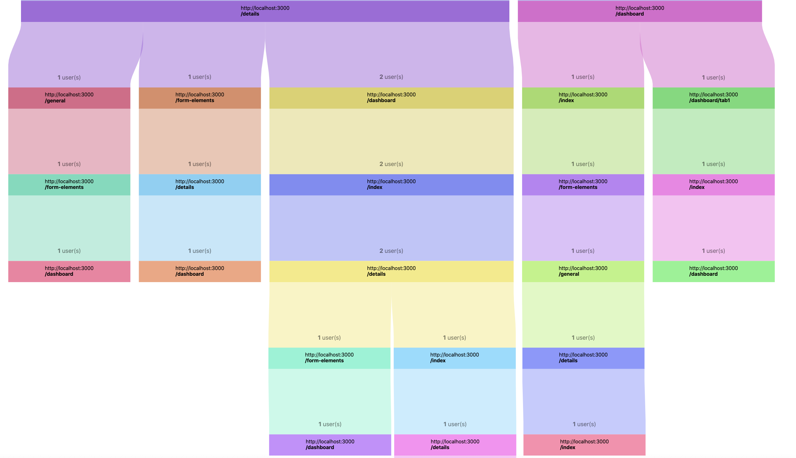

# User Flow Plugin

This plugin was built using the amCharts 4 library for Matomo v4.0.0-b2. 

[Developer's Guide](./docs/index.md)

## Description

Analyzes the workflow of users of a website tracked by Matomo.  
Provides metrics such as the number of visitors on the website, 
their average time spent on a particular URL and the subsequent URL
which they have moved on to.

## Installation

To install Matomo, visit the installation guide [here](https://matomo.org/docs/installation/).

To add to this plugin Matomo, add the entire repository to matomo/plugins folder.  
Activate the plugin from Settings > Plugins or type
`./console plugin:activate UserFlow` in the root folder of Matomo.

## Specifications

The plugin currently defaults to tracking for the last 100 visitors and records up to 30 actions
performed by the visitors. This configuration is what is more suitable for the UI in most cases.  
To modify any of these configurations, change the class attributes in the `UserFlow/API.php` file.  
`$MAX_ACTION_STEPS` => number of URL actions by each visitor to track (note that refreshing is counted as one action)  
`$MAX_VISITORS` => numbers of visitors to track e.g last 100  
`$GROUPED_NODES` => by setting this to true, refreshing a page while staying on the same URL will be collapsed into one node.  

