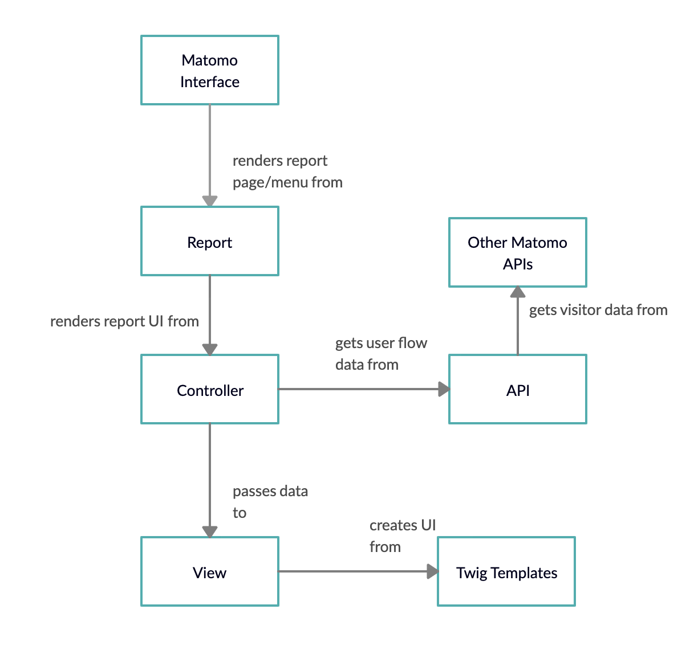

# Developer Guide

## 1. Installation
To install Matomo, visit the installation guide [here](https://matomo.org/docs/installation/).  
To set up the Matomo development environment, use the developer guide [here](https://developer.matomo.org/guides/getting-started-part-1).  

To add to this plugin Matomo, add the entire repository to matomo/plugins folder.  
Activate the plugin from Settings > Plugins or type
`./console plugin:activate UserFlow` in the root folder of Matomo.

## 2. Design Overview
>This guide only covers the design of the User Flow plugin and is not
>representative of the design of any other Matomo plugin.  

  
 
#### Three main components:
- [API](#31-api)
- [Controller](#32-controller)
- [View/Twig Templates](#33-twig-templates)

#### Flow of data:  
The User Flow API retrieves visitor information from the Live plugin
using `Request::processRequest(Live.getLastVisitDetails)` for the last
100 visitors. 

The API creates a user flow tree as well as a summary in the form of a 
Matomo DataTables. The Controller retrieves these DataTables, the summary
is rendered in the default UI defined by existing Matomo APIs, while the
user flow tree is converted into a PHP array and passed into a Twig template
via a View object. 

The Twig template converts the PHP array to a JavaScript array and the user 
flow tree is rendered using the amCharts library. The view is then rendered
by the Controller, which is called upon when a Report tries to retrieve its UI 
(i.e when you click on a particular Report in the Matomo interface).

#### Specifications

The plugin currently defaults to tracking for the last 100 visitors and records up to 30 actions
performed by the visitors. This configuration is what is more suitable for the UI in most cases.  
To modify any of these configurations, change the class attributes in the `UserFlow/API.php` file.  
`$MAX_ACTION_STEPS` => number of URL actions by each visitor to track (note that refreshing is counted as one action)  
`$MAX_VISITORS` => numbers of visitors to track e.g last 100  
`$GROUPED_NODES` => by setting this to true, refreshing a page while staying on the same URL will be collapsed into one node.  

## 3. Implementation

### 3.1 API
These are the following reports generated by the User Flow API:
1) getUserFlowTree
2) getSummary

#### 3.1.1 getUserFlowTree
**Input**: DataTable from Live.getLastVisitDetails
Each row in the above DataTable represents a unique visitor, and provides
 a variety of metrics regarding each visitor, such as the browser used, time spent
 etc. The UserFlow API only looks at the `actionDetails` of each visitor.

If consecutive actions occur on the same URL, they will be considered as one node in the
user flow. 
> Note that the DataTable only allows you to retrieve rows by its `label` (as far as I know)

**Psuedo Code** 
<pre>
for each visitor:  
    access URL of first action  
    retrieve entry node from URL to ID mapping  
    if mapping does not exist:  
        create a node and add to DataTable and update URL to ID mapping
        
    for URLs of subsequent actions:  
        if there exists a child of the previous node that represents the URL:
            increment visitor and update average time
        else if the URL is the same as the URL of the previous action:
            access the previous node and update average time
        else:
            create a new node and add it to the DataTable
            update the previous node to contain this node as a child
</pre>

#### 3.1.2 getSummary
**Input**: DataTable from `getUserFlowTree`  
**Output**: Most commonly used workflow by all users

Process: The User Flow Tree is simply traversed and the algorithm picks the path with the highest weight (i.e most visitors). Along the way, it adds the URL of the nodes as well as the average time spent on the particular URL in the workflow.  
If there are multiple trees or paths with the same weight, the algorithm does a DFS of the paths and picks the path with the highest depth (i.e longest path).

### 3.2 Controller
The methods in the controllers define the UI of reports with the same name. i.e
controller function `getUserFlowTree()` renders the UI of the report `getUserFlowTree()`.
In `getUserFlowTree()`, the user flow sankey diagram and the summary table are rendered using `renderChart()`
and `getSummary()` respectively. `getSummary()` renders a default Matomo view for the DataTable while
`renderChart()` renders the `_userflowViz.twig` template, which makes use of the Javascript amChart library.

### 3.3 Twig Templates
The Twig Templates handle the main UI of the plugin. 
`_userflowViz.twig` represents the Sankey diagram of the User Flow. The data is first
passed into the Twig template in the form of a PHP array, which is then passed into Javascript. A tree traversal is done to 
create links between each parent-child pair.
>Note: The order in which the links are added matters as the each link is rendered in order
>from left to right. Adding links in the wrong order may result in tangling of the
>Sankey links.